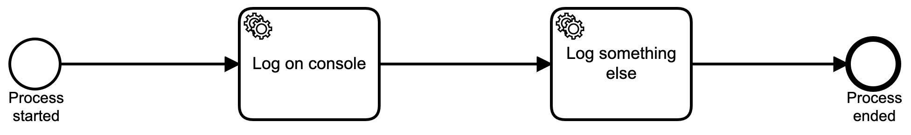

# Quarkus External Task Client Example

This example showcases the functionality of the Quarkus External Task Worker. 
It consists of two submodules. The first module is the Camunda Process Engine build with the [Camunda Quarkus Extension](https://github.com/camunda/camunda-bpm-platform/tree/master/quarkus-extension).
This engine deploys a simple process with two external tasks (see below).
It also provides an interface to the camunda services, which is not included with the extension.



The second module includes the implementations of the external workers using the Quarkus-External-Task extension.
The implementations are using the ``ExternalTaskSubscription`` annotation to subscribe to the topic of the process (see below).

```java

@ApplicationScoped
@ExternalTaskSubscription(topicName = "LogOnConsole")
public class LogOnConsoleHandler implements ExternalTaskHandler {

    private static final Logger LOG = Logger.getLogger(LogOnConsoleHandler.class.getName());

    @Override
    public void execute(ExternalTask externalTask, ExternalTaskService externalTaskService) {
        LOG.info("This is an external task handler logging to the console");
        externalTaskService.complete(externalTask);
    }
}
```

## Start the engine

Start the process engine inside a terminal with the following commands:

```
    cd example-engine && mvn clean quarkus:dev
```

## Create a process instance

To start process instance you can request the following URL:

```
    curl http://localhost:8080/start-process
```

## Start the external task worker

Now you should open a separate terminal to start external task worker. Use the following commands:

```
    cd example-worker && mvn clean quarkus:dev
```

Notice how the external task worker is requesting and completing the external task in both terminals.